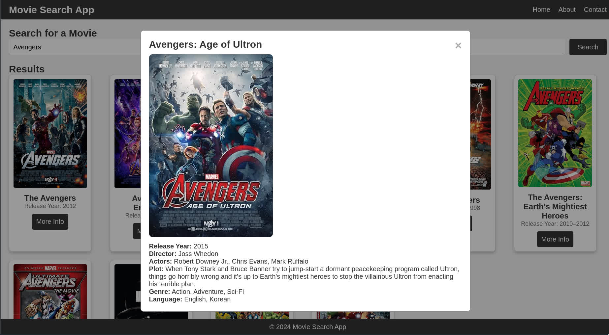

# Movie Search App

A simple movie search application that allows users to search for movies, view detailed information, and get movie details in a modal.

## Features

- **Search for Movies**: Enter a movie name to search for.
- **Movie Results**: Displays a list of movies with basic details.
- **Movie Details**: View detailed information about a selected movie in a modal.

## Demo

## Technologies Used

- **HTML**: Markup for the structure of the app.
- **CSS**: Styling for a responsive and user-friendly interface.
- **JavaScript**: Handles movie search functionality and dynamic content updates.
- **OMDb API**: Fetches movie data and details.

## Getting Started

### Prerequisites

- A modern web browser (e.g., Chrome, Firefox).
- An internet connection to fetch movie data.
- OMDb API
